## Time Series Data Analysis and Visualisation

In this project I'm trying to analyze and visualize the Time Series Data. I will decompose time series into Trend, Seasonality and Residual and then Visualize.I will also Forecast Future Value by using different model i.e Simple Average Model, Moving Average Model, Exponential Average Model, Holt Linear Trend Model, Holt Winter Model And ARIMA (Auto Regression Integrated Moving Average) Model. 

## Data Description

    Month - Date Column
    
    Sales - Corresponding Sale to that Date
    
## Process

  1)Load The DataSet
  
  2)EDA
  
  3)Visualize the data
  
  4)Decompose into Trend, Seasonality and Residual
  
  5)Split the data into train and Test
  
  6)Build Each Model One by One
  
  7)Evaluate Using RMSE
  
## Softwares and Libraries Used:

    - Anaconda Distribution
	  - Jupyter Notebook
	
	  - Numpy
	  - Pandas
	  - Matplotlib
	  - Seaborn
    - Sklearn 
    - warnings
    - math
    - statsmodels
    
## Importing the Modules:

    import pandas as pd
    import os as os
    import numpy as np

    import matplotlib.pyplot as plt
    import seaborn as sns

    from sklearn.metrics import mean_squared_error
    from math import sqrt

    import warnings
    warnings.filterwarnings("ignore")

    from statsmodels.tsa.seasonal import seasonal_decompose
    from statsmodels.tsa.api import SimpleExpSmoothing
    from statsmodels.tsa.api import Holt
    from statsmodels.tsa.api import ExponentialSmoothing
    from statsmodels.tsa.stattools import adfuller
    from statsmodels.graphics.tsaplots import plot_acf
    from statsmodels.graphics.tsaplots import plot_pacf
    from statsmodels.tsa.api import ARIMA
    
## Analysis:

1)Plot Time Series Data

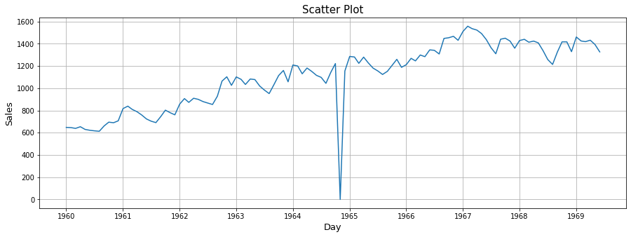

2)Replace Outlier by "ffill method"

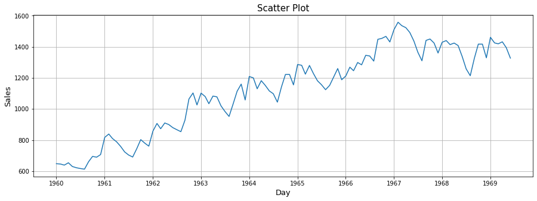

3)Decompose Time Series into Trend, Seasonality and Residual

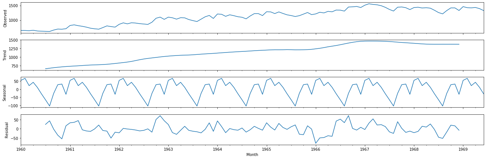

4)Split into Train and Test

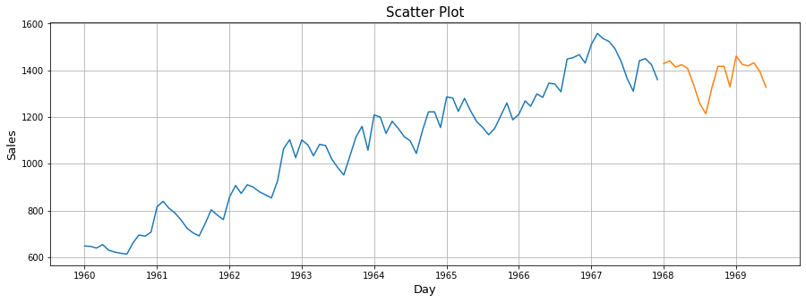

Model Analysis

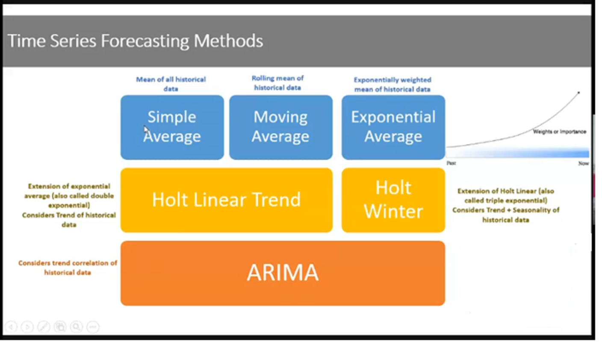

5)Simple Average Model = Predict the Test Value by taking mean of train data Set

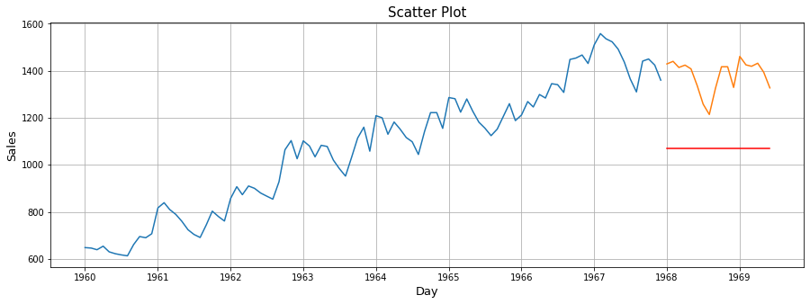

Rmse for Simple Average Model = 317.2

6)Rolling Average Model = Taking mean of specific window span of train data.

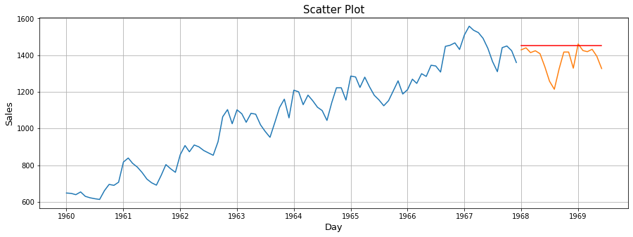

Rmse for Simple Average Model = 95.26

7)Exponential Average Model = Giving weightage to data points where in High weightage is given to previous neighbouring values and goes on decreasing as we proceed to further previous value

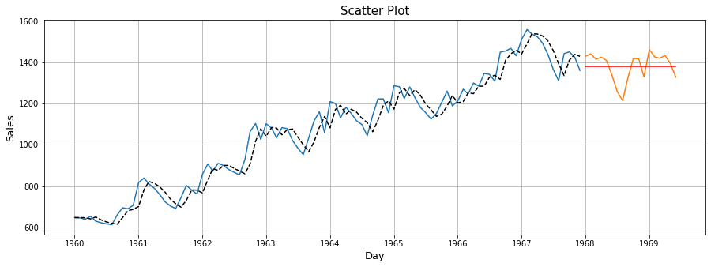

Rmse for Simple Average Model = 65.92

8)Residual Plot of Exponential Average Model = Thus Error should be around mean with less variance and Should be Normally distributed

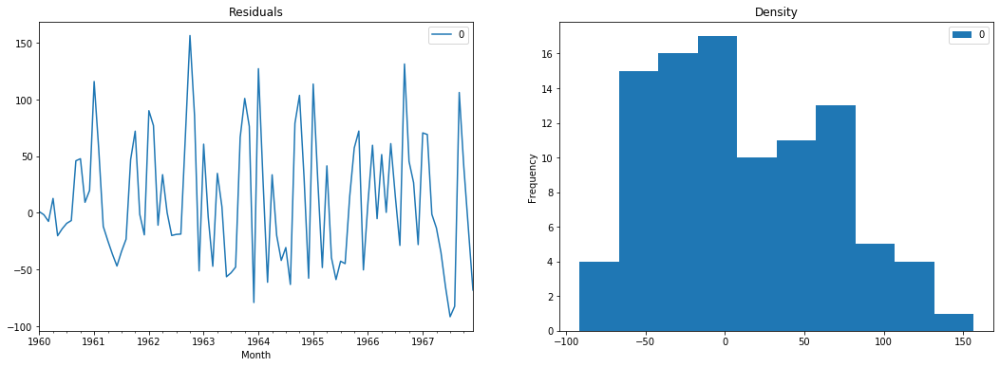

9)Holt Linear Trend Model = Consider Only Trend from data set

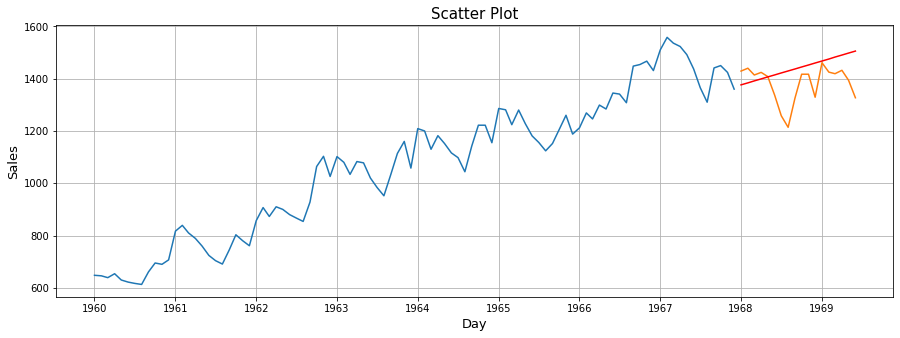

Rmse for Simple Average Model = 97.31

10)Residual Plot of Holt Linear Trend Model = Thus Error should be around mean with less variance and Should be Normally distributed

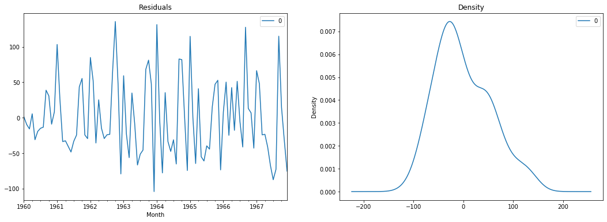

11)Holt Winter Model = Consider Both Trend And Seasonality from data set

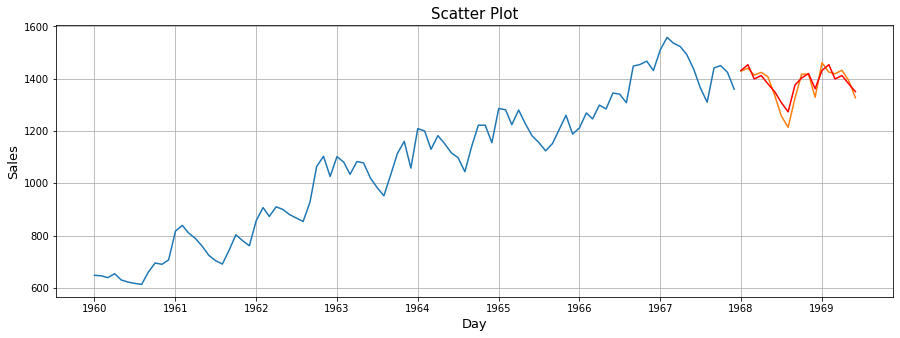

Rmse for Simple Average Model = 28.4

12)Residual Plot of Holt Winter Model = Thus Error should be around mean with less variance and Should be Normally distributed

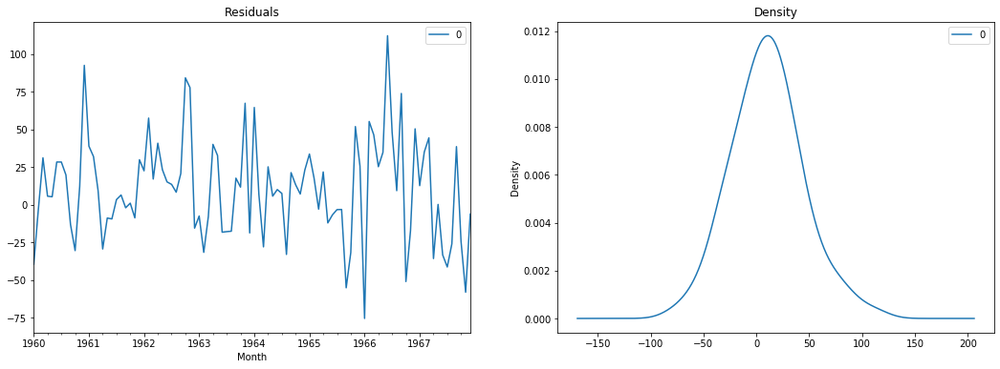

13)ARIMA Model 

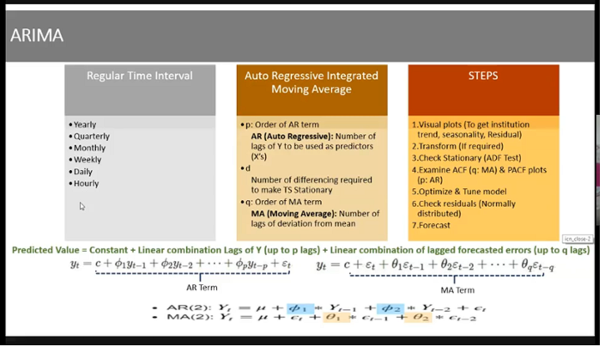

For ARIMA model data should be stationary we will check stationarity via adfuller Test and if not stationary then convert to stationary via Single or Double Differencing

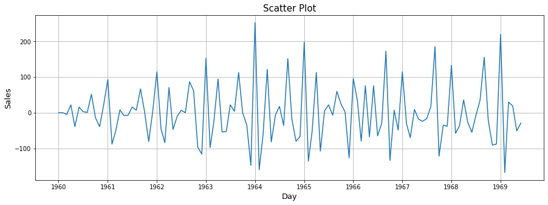

To get Moving Average Value (q) use ACF plot

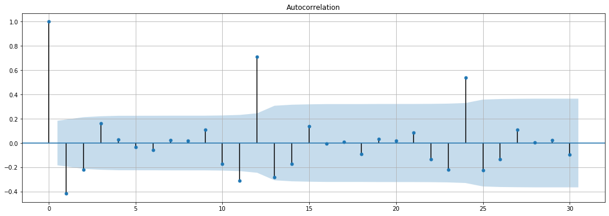

To get Auto Regression Value (p) use PACF plot

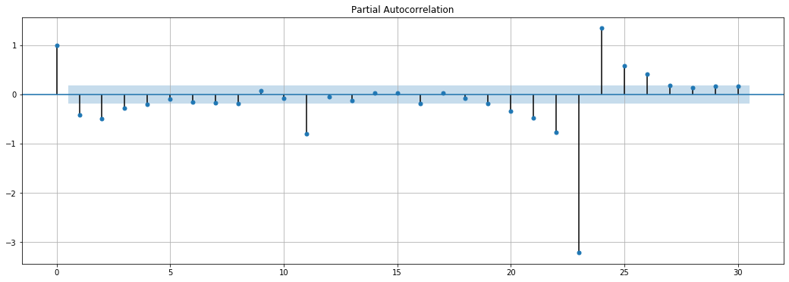

Forecasting Using Arima Model and consider 2 cofidence interval ( Blue Color= 5% Error , green color = 20% Error)

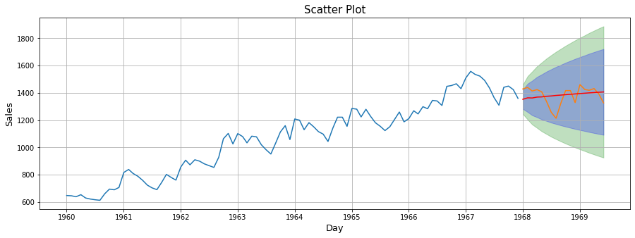

Residual Plot For ARIMA

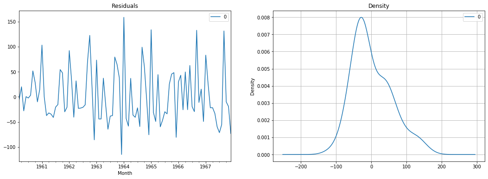

## Conclusing Statement

  Thus Amongst all the model we can see that Holt Winter Model give lowest RMSE i.e around 28%. Thus we can Consider Holt Winter Model
  
## Note

  You can also view the code in HTML format

